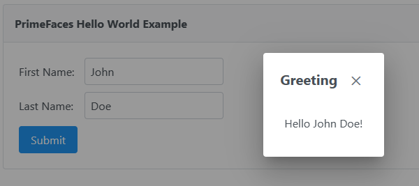

## JSF 4 with Spring boot 3.1.1 example
### This example was created using [joinfaces](https://github.com/joinfaces/joinfaces)

Basic project showing the use of combining Jakarta Server Faces 4 with Springboot 3.1.1. 

Thanks to the contributors of Joinfaces for making this possible.
Special thanks to [larsgrefer](https://github.com/larsgrefer) for helping to fix the issues.

To run this project, Simply do ```mvn clean install``` and run the JSFWithSpringBootApplication.java
<br>Open browser and go to http://localhost:8085.
<br>You should see a page like this when you click on `Submit` button - 



Feel free to use this as a base for your other projects 😊

### License
This is Open Source software released under the [Apache 2.0 license](https://www.apache.org/licenses/LICENSE-2.0.html).
